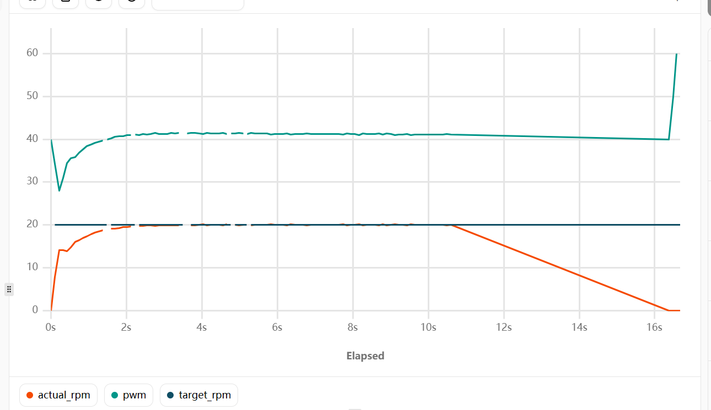
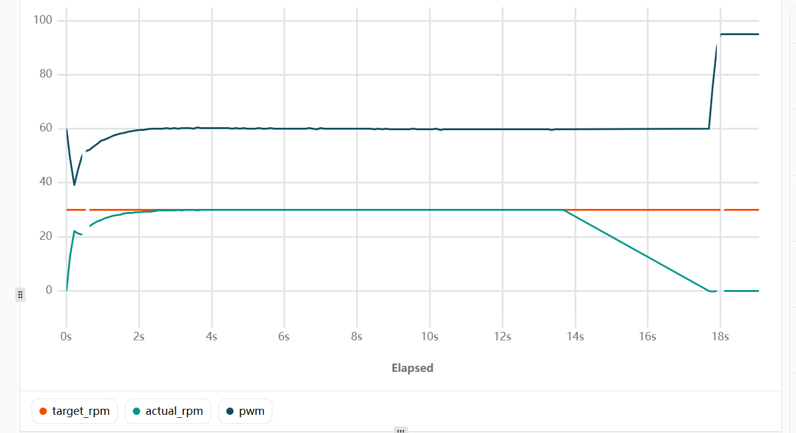
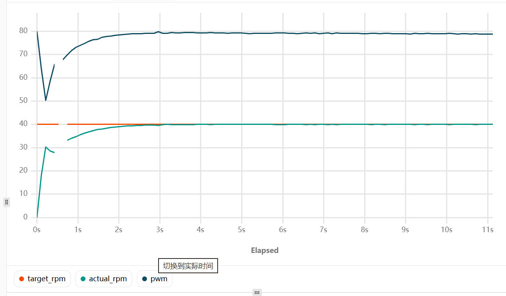

# PID 实验数据记录

本页记录直流电机速度闭环控制实验结果。实验通过编码器测量实际转速，使用 PI 控制器计算 PWM 输出，使电机实际转速跟踪目标转速。

## 实验条件

- 控制对象：带编码器的直流电机
- 反馈量：编码器计算得到的实际转速
- 控制量：PWM 输出
- 控制算法：PI 控制
- 记录指标：目标转速、实际转速范围、PWM 输出范围

## 目标转速 20 rpm

- 实际转速：19.930071 ~ 20.010759 rpm
- PWM 输出：41.0086 ~ 41.2964

## 目标转速 30 rpm

- 实际转速：29.939450 ~ 30.016138 rpm
- PWM 输出：59.7741 ~ 59.9274

## 目标转速 40 rpm

- 实际转速：39.940830 ~ 40.102207 rpm
- PWM 输出：78.9349 ~ 79.1393

## PI 参数整定记录

- `Kp = 1.5`
- `Ki = 0.5`
- 积分项限幅：`2000`

## 初步结论

在当前实验条件下，目标转速分别设置为 20 rpm、30 rpm 和 40 rpm 时，实际转速能够稳定跟踪目标值。后续还可以继续记录启动时间、超调量、稳态误差以及负载变化下的控制效果。
