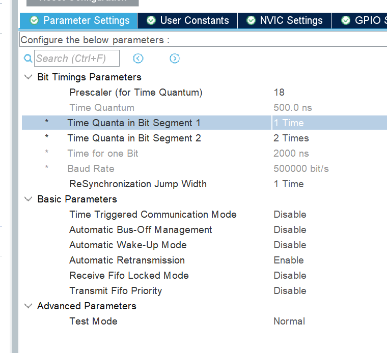

# 01\_单节点回环模式自发自收（实验）

# V1\.0 位时序配置采用AI，并以此为基础编程实现

## CubeMX配置内容



- RCC：使用晶振作为外部高速时钟的时钟源，主频设为72MHz，APB1经过2分频后为36MHz（最高）。

- cubemx启动CAN，自动设置引脚为PA11和PA12。

- CAN模式选为Loopback——回环模式。

- AJI推荐的具体配置：Prescaler为18，BS1=1，BS2=2,SJW=1。

- 使能中断：USB low priority or CAN RX0 interrupts。。

## 编写实验程序

### 变量定义

```C
CAN_TxHeaderTypeDef TxHeader;
CAN_RxHeaderTypeDef RxHeader;
CAN_FilterTypeDef  sFilterConfig;
uint8_t TxData[8] = {0x01, 0x02, 0x03, 0x04, 0x05, 0x06, 0x07, 0x08};
uint8_t RxData[8];
uint32_t TxMailbox;
```

### 初始化过滤器，启动CAN，使能中断

```C
/* 1. 配置过滤器：掩码全0，接收所有ID */
sFilterConfig.FilterActivation = ENABLE;
sFilterConfig.FilterMode = CAN_FILTERMODE_IDMASK;
sFilterConfig.FilterScale = CAN_FILTERSCALE_32BIT;
sFilterConfig.FilterIdHigh = 0x0000;
sFilterConfig.FilterIdLow = 0x0000;
sFilterConfig.FilterMaskIdHigh = 0x0000;
sFilterConfig.FilterMaskIdLow = 0x0000;
sFilterConfig.FilterFIFOAssignment = CAN_RX_FIFO0;
sFilterConfig.FilterBank = 0;
sFilterConfig.SlaveStartFilterBank = 0; 
HAL_CAN_ConfigFilter(&hcan, &sFilterConfig);

/* 2. 启动CAN外设 */
HAL_CAN_Start(&hcan);

/* 3. 开启接收中断通知 */
HAL_CAN_ActivateNotification(&hcan, CAN_IT_RX_FIFO0_MSG);
```

### 发送逻辑

```C
/* 配置发送帧头 */
TxHeader.StdId = 0x123;        // 标准帧ID，随意写
TxHeader.ExtId = 0;
TxHeader.IDE = CAN_ID_STD;     // 标准帧
TxHeader.RTR = CAN_RTR_DATA;   // 数据帧
TxHeader.DLC = 8;              // 数据长度8

/* 发送数据 */
if (HAL_CAN_AddTxMessage(&hcan, &TxHeader, TxData, &TxMailbox) != HAL_OK)
{
    // 发送失败处理（可在这里打断点查看错误）
}

HAL_Delay(1000); // 延时1秒，避免疯狂发送导致刷屏
```

### 接收回调函数

```C
void HAL_CAN_RxFifo0MsgPendingCallback(CAN_HandleTypeDef *hcan)
{
    /* 从FIFO0取出数据 */
    if (HAL_CAN_GetRxMessage(hcan, CAN_RX_FIFO0, &RxHeader, RxData) == HAL_OK)
    {
       //打断点
       HAL_Delay(1000);
    }
}
```

## 连接硬件并运行、调试

回调函数中，如果接收数组 RxData 中的数据是12345678，说明实验成功。

## 发现错误

程序根本不进入回调函数

## 调试记录

### 初始现象

程序运行后：

```Plain Text
接收回调函数不进入
fill = 0
断点无法命中
```

代码：

```C
HAL_CAN_ConfigFilter();
HAL_CAN_Start();
HAL_CAN_ActivateNotification();

while(1)
{
    HAL_CAN_AddTxMessage(...);
}
```

理论上应该进入：

```C
HAL_CAN_RxFifo0MsgPendingCallback()
```

实际未进入。

---

### 第一轮排查

#### 怀疑点

##### CAN启动失败

增加：

```C
HAL_StatusTypeDef can_start_ret;

can_start_ret = HAL_CAN_Start(&hcan);
```

查看：

```Plain Text
can_start_ret
```

最初误认为：

```Plain Text
HAL_ERROR
```

因此开始怀疑：

- CAN时钟

- GPIO配置

- 波特率配置

- CAN初始化

---

### 检查项

检查：

```C
HAL_CAN_MspInit()
```

确认：

```C
__HAL_RCC_CAN1_CLK_ENABLE();
```

存在。

确认：

```C
PA11 -> CAN_RX
PA12 -> CAN_TX
```

配置正确。

---

结果

后续重新验证发现：

```Plain Text
can_start_ret = HAL_OK
```

CAN启动正常。

说明之前属于调试判断失误。

---

### 第二轮排查

增加：

```C
HAL_CAN_GetError(&hcan);
```

发现：

```Plain Text
can_err = 0x20000048
```

最初误认为：

```Plain Text
CAN启动失败
```

后分析发现：

该错误码属于历史累计错误。

原因：

```Plain Text
前期多次修改代码
↓
发送失败
↓
历史错误未清除
```

因此错误码不能直接用于判断当前状态。

---

### 第三轮排查

增加：

```C
tx_ret =
    HAL_CAN_AddTxMessage(...);

txFree =
    HAL_CAN_GetTxMailboxesFreeLevel(...);

fill =
    HAL_CAN_GetRxFifoFillLevel(...);
```

观察：

```Plain Text
tx_ret = HAL_OK
txFree = 2
fill = 0
```

分析：

tx\_ret = HAL\_OK

说明：

```Plain Text
发送请求成功进入邮箱
```

---

txFree = 2

说明：

```Plain Text
3个邮箱
↓
占用1个
↓
剩余2个
```

证明：

```Plain Text
发送函数已执行
```

---

fill = 0

最初怀疑：

```Plain Text
没有收到报文
```

后续证明：

```Plain Text
收到报文后
↓
回调立即读取
↓
FIFO被清空
↓
再次查看fill为0
```

属于正常现象。

---

### 关键问题发现

调试过程中发现：

```Plain Text
发送函数被误删
```

代码变成：

```C
while(1)
{
    ...
}
```

没有：

```C
HAL_CAN_AddTxMessage(...)
```

导致：

```Plain Text
txFree = 3
fill = 0
```

误以为CAN驱动异常。

实际上：

```Plain Text
根本没有发送报文
```

属于调试过程中引入的新问题。

# V2\.0 回环实验成功运行版本

## 程序代码

调试过程中不断尝试

改了SJW，BS1,BS2的位时序数量更合适

其他的大部分都是检查错误的函数

```C
/* USER CODE BEGIN Header */
*/***
*  *******************************************************************************
*  * @file           : main.c*
*  * @brief          : Main program body*
*  *******************************************************************************
*  * @attention*
*  **
*  * Copyright (c) 2026 STMicroelectronics.*
*  * All rights reserved.*
*  **
*  * This software is licensed under terms that can be found in the LICENSE file*
*  * in the root directory of this software component.*
*  * If no LICENSE file comes with this software, it is provided AS-IS.*
*  **
*  *******************************************************************************
*  */*
/* USER CODE END Header */
/* Includes ------------------------------------------------------------------*/
#include "main.h"

#include <string.h>

#include "can.h"
#include "gpio.h"

/* Private includes ----------------------------------------------------------*/
/* USER CODE BEGIN Includes */

/* USER CODE END Includes */

/* Private typedef -----------------------------------------------------------*/
/* USER CODE BEGIN PTD */

/* USER CODE END PTD */

/* Private define ------------------------------------------------------------*/
/* USER CODE BEGIN PD */

/* USER CODE END PD */

/* Private macro -------------------------------------------------------------*/
/* USER CODE BEGIN PM */

/* USER CODE END PM */

/* Private variables ---------------------------------------------------------*/

/* USER CODE BEGIN PV */

CAN_TxHeaderTypeDef TxHeader;
CAN_RxHeaderTypeDef RxHeader;
CAN_FilterTypeDef  sFilterConfig;
uint8_t TxData[8] = {0x01, 0x02, 0x03, 0x04, 0x05, 0x06, 0x07, 0x08};
uint8_t RxData[8];
uint32_t TxMailbox;
volatile uint32_t can_rx_cnt = 0;

/* USER CODE END PV */

/* Private function prototypes -----------------------------------------------*/
void SystemClock_Config(void);
/* USER CODE BEGIN PFP */

/* USER CODE END PFP */

/* Private user code ---------------------------------------------------------*/
/* USER CODE BEGIN 0 */

/* USER CODE END 0 */

*/***
*  * @brief  The application entry point.*
*  * @retval int*
*  */*
int main(void)
{

  /* USER CODE BEGIN 1 */

  /* USER CODE END 1 */

  /* MCU Configuration--------------------------------------------------------*/

  /* Reset of all peripherals, Initializes the Flash interface and the Systick. */
  HAL_Init();

  /* USER CODE BEGIN Init */

  /* USER CODE END Init */

  /* Configure the system clock */
  SystemClock_Config();

  /* USER CODE BEGIN SysInit */

  /* USER CODE END SysInit */

  /* Initialize all configured peripherals */
  MX_GPIO_Init();
  MX_CAN_Init();
  /* USER CODE BEGIN 2 */

  //1.配置CAN过滤器

  //创建CAN过滤器配置的固定结构体的变量


  //对结构体中各成员赋值
  sFilterConfig.FilterActivation = *ENABLE*;
  sFilterConfig.FilterMode = CAN_FILTERMODE_IDMASK;
  sFilterConfig.FilterScale = CAN_FILTERSCALE_32BIT;
  sFilterConfig.FilterIdHigh = 0x0000;
  sFilterConfig.FilterIdLow = 0x0000;
  sFilterConfig.FilterMaskIdHigh = 0x0000;
  sFilterConfig.FilterMaskIdLow = 0x0000;
  sFilterConfig.FilterFIFOAssignment = CAN_RX_FIFO0;
  sFilterConfig.FilterBank = 0;
  sFilterConfig.SlaveStartFilterBank = 0;

  //使用设置过滤器函数将配置应用
  if(HAL_CAN_ConfigFilter(&hcan,&sFilterConfig)!=*HAL_OK*)
  {
    Error_Handler();
  }

  HAL_StatusTypeDef can_start_ret;

  can_start_ret = HAL_CAN_Start(&hcan);


  uint32_t can_err =HAL_CAN_GetError(&hcan);

  if(can_start_ret != *HAL_OK*)
  {
    while(1)
    {
    }
  }
  if(HAL_CAN_ActivateNotification(
          &hcan,
          CAN_IT_RX_FIFO0_MSG_PENDING)!=*HAL_OK*)
  {
    Error_Handler();
  }


  //3.开启接收中断通知_IT_RX_FIFO0_MSG_PENDING);

  /* USER CODE END 2 */

  /* Infinite loop */
  /* USER CODE BEGIN WHILE */
  while (1)
  {
    /* USER CODE END WHILE */

    /* USER CODE BEGIN 3 */

    //设置发送消息的结构体
    memset(&TxHeader, 0, sizeof(TxHeader));

    TxHeader.StdId = 0x123;
    TxHeader.IDE   = CAN_ID_STD;
    TxHeader.RTR   = CAN_RTR_DATA;
    TxHeader.DLC   = 8;

    if (HAL_CAN_AddTxMessage(&hcan, &TxHeader, TxData, &TxMailbox) != *HAL_OK*)
    {
      // 发送失败处理（可在这里打断点查看错误）
    }
    uint32_t mailPending =
        HAL_CAN_IsTxMessagePending(
            &hcan,
            CAN_TX_MAILBOX0 |
            CAN_TX_MAILBOX1 |
            CAN_TX_MAILBOX2);

    HAL_StatusTypeDef tx_ret;

    tx_ret = HAL_CAN_AddTxMessage(
                &hcan,
                &TxHeader,
                TxData,
                &TxMailbox);

    uint32_t txFree =
            HAL_CAN_GetTxMailboxesFreeLevel(&hcan);

    uint32_t fill =
            HAL_CAN_GetRxFifoFillLevel(
                &hcan,
                CAN_RX_FIFO0);
    /* 发送数据 */
    if (HAL_CAN_AddTxMessage(&hcan,
                         &TxHeader,
                         TxData,
                         &TxMailbox) != *HAL_OK*)
    {
      uint32_t err = HAL_CAN_GetError(&hcan);

      Error_Handler();
    }
    // uint32_t fill;
    //
    // fill = HAL_CAN_GetRxFifoFillLevel(
    //             &hcan,
    //             CAN_RX_FIFO0);
    HAL_Delay(1000); // 延时1秒，避免疯狂发送导致刷屏

  }

  /* USER CODE END 3 */
}

*/***
*  * @brief System Clock Configuration*
*  * @retval None*
*  */*
void SystemClock_Config(void)
{
  RCC_OscInitTypeDef RCC_OscInitStruct = {0};
  RCC_ClkInitTypeDef RCC_ClkInitStruct = {0};

  /** Initializes the RCC Oscillators according to the specified parameters
  * in the RCC_OscInitTypeDef structure.
  */
  RCC_OscInitStruct.OscillatorType = RCC_OSCILLATORTYPE_HSE;
  RCC_OscInitStruct.HSEState = RCC_HSE_ON;
  RCC_OscInitStruct.HSEPredivValue = RCC_HSE_PREDIV_DIV1;
  RCC_OscInitStruct.HSIState = RCC_HSI_ON;
  RCC_OscInitStruct.PLL.PLLState = RCC_PLL_ON;
  RCC_OscInitStruct.PLL.PLLSource = RCC_PLLSOURCE_HSE;
  RCC_OscInitStruct.PLL.PLLMUL = RCC_PLL_MUL9;
  if (HAL_RCC_OscConfig(&RCC_OscInitStruct) != *HAL_OK*)
  {
    Error_Handler();
  }

  /** Initializes the CPU, AHB and APB buses clocks
  */
  RCC_ClkInitStruct.ClockType = RCC_CLOCKTYPE_HCLK|RCC_CLOCKTYPE_SYSCLK
                              |RCC_CLOCKTYPE_PCLK1|RCC_CLOCKTYPE_PCLK2;
  RCC_ClkInitStruct.SYSCLKSource = RCC_SYSCLKSOURCE_PLLCLK;
  RCC_ClkInitStruct.AHBCLKDivider = RCC_SYSCLK_DIV1;
  RCC_ClkInitStruct.APB1CLKDivider = RCC_HCLK_DIV2;
  RCC_ClkInitStruct.APB2CLKDivider = RCC_HCLK_DIV1;

  if (HAL_RCC_ClockConfig(&RCC_ClkInitStruct, FLASH_LATENCY_2) != *HAL_OK*)
  {
    Error_Handler();
  }
}

/* USER CODE BEGIN 4 */

  /* 从FIFO0取出数据 */
  void HAL_CAN_RxFifo0MsgPendingCallback(CAN_HandleTypeDef *hcan)
  {
  // ← 这里打断点

  if(HAL_CAN_GetRxMessage(
          hcan,
          CAN_RX_FIFO0,
          &RxHeader,
          RxData) == *HAL_OK*)
  {
    //。。。
}
  }
/* USER CODE END 4 */

*/***
*  * @brief  This function is executed in case of error occurrence.*
*  * @retval None*
*  */*
void Error_Handler(void)
{
  /* USER CODE BEGIN Error_Handler_Debug */
    /* User can add his own implementation to report the HAL error return state */
    __disable_irq();
    while (1)
    {
    }
  /* USER CODE END Error_Handler_Debug */
}
#ifdef USE_FULL_ASSERT
/**
  * @brief  Reports the name of the source file and the source line number
  *         where the assert_param error has occurred.
  * @param  file: pointer to the source file name
  * @param  line: assert_param error line source number
  * @retval None
  */
void assert_failed(uint8_t *file, uint32_t line)
{
  /* USER CODE BEGIN 6 */
    /* User can add his own implementation to report the file name and line number,
       ex: printf("Wrong parameters value: file %s on line %d\r\n", file, line) */
  /* USER CODE END 6 */
}
#endif /* USE_FULL_ASSERT */
```

## 总结

调试过程中，在每个接口函数加上if判断，如果返回值不是正常运行（HAL\_OK\)就进入ERROR函数，此函数里只有一个while\(1\)无限循环，这样如果运行不到断点，手动暂停函数时查看在从哪里进入的ERROR就知道了

然后发现是CAN启动失败，去找CAN启动相关的寄存器读取函数，然后打断点，读取值之后判断

连续找了一大堆，怎么也不好使，改着改着感觉哪里都没有问题，最后发现是之前改代码时候把启动函数写重复，就是**写了条件判断的启动函数返回值是否正常时，在条件的括号内使用启动函数了，原本第一版本的启动函数没有删除，即：**

**就是先——启动函数**

**然后——if（状态变量！=启动函数）**


删除掉之后，启动函数没有问题了


继续条件判断进入ERROR函数，发现没啥问题但是不能直接跳到断点，于是想着看看发送还是接收的问题

使用函数查询空闲邮箱数

发现始终是3，先考虑没发送出来数据

然后去看发送函数

正要检查各种状态，想到刚刚的前车之鉴，看看发送函数是不是写重复了

然后一看，**中间改代码时候不小心把发送函数删除**了


这两个小破问题用了我一下午\+一晚上，又是学软件调试器怎么用，又是该怎么设置哪些错误判断，又是不断打断点，又是找各种查询寄存器的函数什么的

## 收获

熟练使用CLion调试器了

知道别马虎，先看看是不是缺少什么

以及保留原始版本，始终有权利去任意对比程序，区分错误


