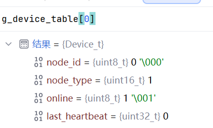

# 05\_初版设备管理机制

# 设备管理（注册信息填入设备表）程序代码

先不使用动态增加设备表（申请内存使得结构体\+1）

```C++

typedef struct
{
    uint8_t node_id;
    uint16_t node_type;
    uint8_t online;
    uint32_t last_heartbeat;
}Device_t;

*//先不做可自动扩展设备表，且因此这个宏定义先挨着放*
#define MAX_DEVICE_NUM 10
extern Device_t g_device_table[MAX_DEVICE_NUM];


Device_t g_device_table[MAX_DEVICE_NUM];

*/*将注册报文填入设备表的靠前的空余位*/*
void DeviceManager_Register(const Register_Msg_t *msg)
{
    for(int i=0;i<MAX_DEVICE_NUM;i++)
    {
        if(g_device_table[i].online == 0)
        {
            g_device_table[i].node_id = msg->node_id;

            g_device_table[i].node_type = msg->node_type;

            g_device_table[i].online = 1;

            break;
        }
    }
}

```

# 运行结果

验证连接成功，第一个设备被注册进入设备表




