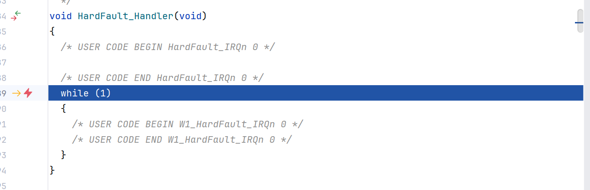
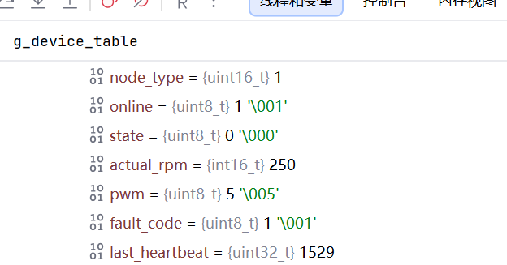

# 08\_初步实现  状态反馈机制

# 程序设计

## 节点获取状态信息及发送状态信息函数

```C
/*获取状态信息函数*/
void App_GetStatus(Status_Msg_t* status)
{
    status->node_id=Local_NodeID;
    status->actual_rpm=250;
    status->pwm=5;
    status->state=NODE_STATE_NORMAL;
    status->fault_code=1;
}

/*发送状态信息*/
void App_Status()
{
    Status_Msg_t status;

    App_GetStatus(&status);

    Protocol_SendStatus(&status);

```

## 主控更新并处理状态信息函数

```C
/*更新状态信息函数*/
void DeviceManager_UpdateState(const Status_Msg_t* state)
{
    Device_t* dev=DeviceManager_FindDevice(state->node_id);
    if (dev!=NULL)
    {
        dev->actual_rpm=state->actual_rpm;
        dev->pwm=state->pwm;
        dev->state=state->state;
        dev->fault_code=state->fault_code;
    }
}

/*处理状态报文的函数*/
void App_HandleStatus(const Status_Msg_t *msg)
{
    DeviceManager_UpdateState(msg);

    // Ack_Msg_t ack;
    // ack.node_id = NODE_ID_MASTER;
    // ack.acked_id = CAN_ID_STATUS;
    // ack.seq_num = 0;
    // ack.result = 1;
    //
    // Protocol_SendAck(&ack);
}
```

# 问题

## 问题描述

状态信息未写入设备表，在处理状态信息函数内部打的断点不能进入

## 调试过程

状态机制初步写完后运行，发现主控卡在硬件中断错误界面

进入了**HardFault——硬件异常**



```C
CPU访问了非法地址
或
栈损坏
或
野指针
或
数组越界
```

先去看看节点怎么样，逐步调试，发现节点发送了心跳、状态，但是始终没有进入回调函数（打断点不停下来）

考虑是主控的接收状态或发送应答信号出问题

回到主控调试

对回调函数进行断点，觉得应该**会起码进入一次回调函数起码，因为心跳机制已经验证过可运行的，如果一次都不进入那么出了大问题了**

果然，进入了回调函数，步入、逐步调试：

发现先进入的是状态处理函数，想起来状态报文优先级较高来着，**所以哪怕上面不进入回调也可能是因为状态先发送然后状态出问题了**

逐步调试：

**进入了更新状态的函数，然后出错**；

**断点直接定位在更新状态函数**，重新逐步调试，找原因：
执行到这一行出错：`dev->fault_code=state->fault_code;`

单独将“=”左右两边的写成语句，看到哪个报错

```C
dev->actual_rpm=state->actual_rpm;
dev->pwm=state->pwm;
dev->state=state->state;     //说明是这里出错了
dev->fault_code;      //运行到这里直接报错了
state->fault_code;          //将上一行删除之后运行到这里也报错了
dev->fault_code=state->fault_code;
```

向上找，发现函数

```C++

/*根据设备ID获取在注册表中的位置*/
Device_t* DeviceManager_FindDevice(uint8_t node_id)
{
    for(int i = 0; i < MAX_DEVICE_NUM; i++)
    {
        if(g_device_table[i].online||g_device_table[i].node_id == node_id)
        {
            return &g_device_table[i];
        }
    }
    return NULL;
}
```

此函数返回值为空

进入函数中一遍遍循环，发现即使  ”i“ 等于node\_id=1时，也不返回值

怀疑是另外一个条件：在线状态出了问题

查找设备表，果然设备表数组的【1】有不在线的节点

说明注册出问题

想到，刚刚调试时，直接进入的回调函数是状态报文的回调函数，说明没有进入注册报文的回调函数

所以此时的在线状态是不在线

是不是因为程序运行太快，注册和状态报文同时发生，发生了抢占

即，注册报文发送后没等待导致被状态报文抢占

注册报文后加延时试试

延时也不行，去检测注册报文，发现第一个接收的还是状态报文，且设备上电后不能进入回调函数

发现，注册报文发送后，节点立马进入回调接收控制报文

之前测试控制报文时的代码没删除，删除了一下

且监测主控发现其始终未进入回调，即未收到注册报文，在初始化后面隔10秒再进行注册试试

发现节点接收到了主控发回的应答信号，此时节点中的心跳、状态都注释掉了，只能是应答注册

进入主控重新监测看看：

主控确实进入了回调且是注册信号的回调，监测设备表，第一个元素已经有注册信息。

总结：**设备进行注册前需要初始化一段时间，设备注册后，需要隔一段时间再发送状态信息、心跳信息，避免抢占注册报文**

暂时选用**等待初始化完成时间**与**等待注册完成时间**都是10s，之后会对注册机制完善，可能不需要单纯等待，所以先不细致时间

恢复心跳机制、状态机制，重新调试，状态写入成功



## 引发的考虑

主控应该也要有初始化时间，先写个5s


