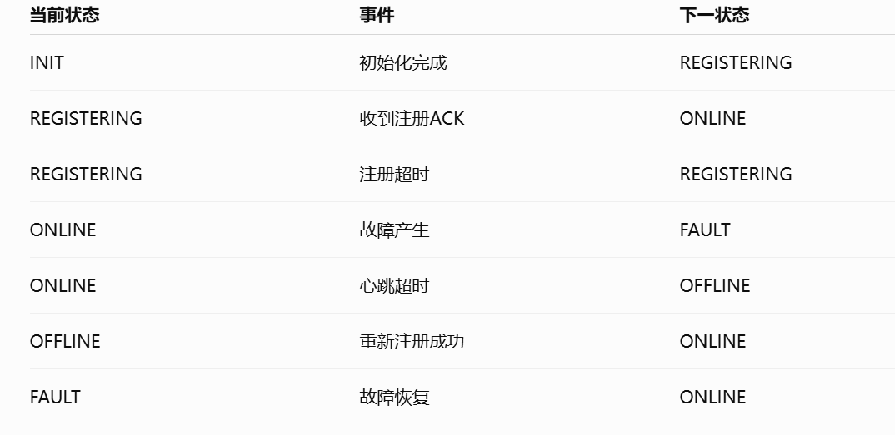
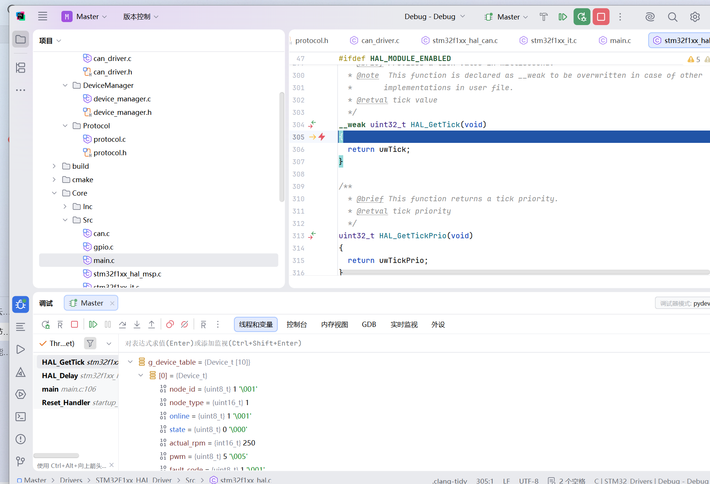
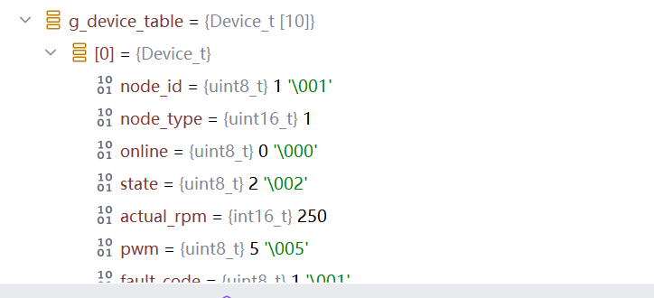

# 09\_初步建立 节点状态机

# 初步建立节点状态机

## 先建立状态枚举，并搭建一个状态机的框架

```C

*/*节点状态机的状态*/*
typedef enum
{
    *NODE_INIT*,
    *NODE_REGISTERING*,
    *NODE_ONLINE*,
    *NODE_FAULT*,
    *NODE_OFFLINE*,
}NodeState_t;


void StateMachine_Update()
{
    switch (g_state)
    {
    case *NODE_INIT*:
        {
            break;
        }
    case *NODE_REGISTERING*:
        {
            break;
        }
    case *NODE_ONLINE*:
        {
            break;
        }
    case *NODE_FAULT*:
        {
            break;
        }
    case *NODE_OFFLINE*:
        {
            break;
        }
    default:
        {
            break;  
        }
    }
}
```

## 细化框架

此时就可以更改具体的发送注册报文需要的时间了

```C++
*//*
*// Created by 双 on 2026/8/28.*
*//*

#include "state_machine.h"

#include "app.h"
#include "motor_control.h"
#include "stm32f1xx_hal.h"

NodeState_t g_state;

void StateMachine_SetState(NodeState_t state)
{
    if (g_state!=state)
    {
        g_state = state;
        *//而且这里可以添加断点来查看状态切换*
*    *}

}

void StateMachine_Update()
{
    switch (g_state)
    {
    case *NODE_INIT*:
        {
            static uint32_t init_time =0;
            if (init_time==0)
            {
                init_time = HAL_GetTick();
            }
            if (HAL_GetTick() - init_time > 5000)
            {
                 StateMachine_SetState(*NODE_REGISTERING*);
            }
            break;
        }
    case *NODE_REGISTERING*:
        {
            static uint32_t last_register_time = 0;
            if(HAL_GetTick() - last_register_time > 1000)
            {
                App_Register();*//接收到应答信号时，回调函数跳转到协议解析后会将状态改为NODE_ONLINE*
*                *last_register_time = HAL_GetTick();
            }

           break;
        }
    case *NODE_ONLINE*:
        {
            static uint32_t heartbeat_tick=0;
            static uint32_t status_tick=0;
            if (HAL_GetTick() - heartbeat_tick > 1000)
            {
                App_Heartbeat();   *//主控的超时检测发现超时后，发送应答信号告知节点ID，经过判断在回调函数内会将对应的节点进入OFFLINE状态*
*                *heartbeat_tick = HAL_GetTick();
            }
            if (HAL_GetTick() - status_tick > 500)
            {
                App_Status();   *//状态函数在获取状态信息后，如果发现状态是FAULT，会进入FAULT*
*                *status_tick = HAL_GetTick();
            }

            break;
        }
    case *NODE_OFFLINE*:
        {
            static uint32_t last_register_time = 0;
            if(HAL_GetTick() - last_register_time > 1000)
            {
                App_Register();*//接收到应答信号时，回调函数跳转到协议解析后会将状态改为NODE_ONLINE*
*                *last_register_time = HAL_GetTick();
            }
            break;
        }
    case *NODE_FAULT*:
        {
            Motor_Stop();

            */*之后会封装一个函数*/*
*            *Status_Msg_t status;
            App_GetStatus(&status);
            if (status.state!=*NODE_FAULT*)
            {
                StateMachine_SetState(*NODE_ONLINE*);
            }

            break;
        }
    default:
        {
            break;
        }
    }
}
```

# 总结

## 状态机图

## 状态转换表



## 节点运行流程图

## 过程中的纠错

状态机中存储时间的变量原本的定义没有加static修饰为本地变量

这样会导致每次循环进入状态机，该变量都会被初始化

导致状态机实际不会向下运行

## 运行结果 

运行成功

等待初始化完成后，设备表中成功存入设备注册信息和状态：



断开一段时间后，设备表中online为0，目前还没实现，掉线超过一定时间后清空设备表中信息的功能：




