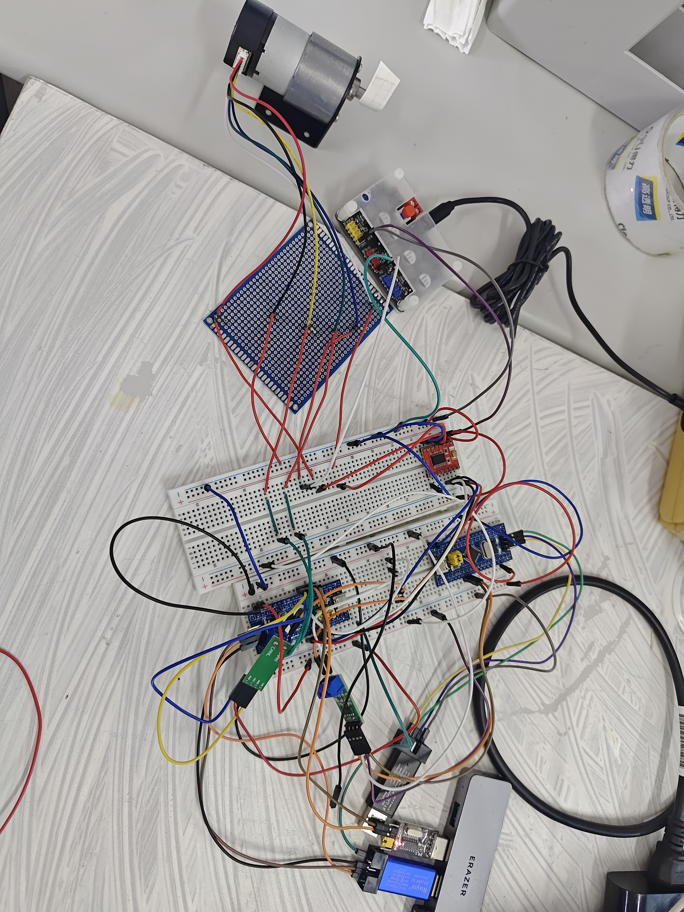
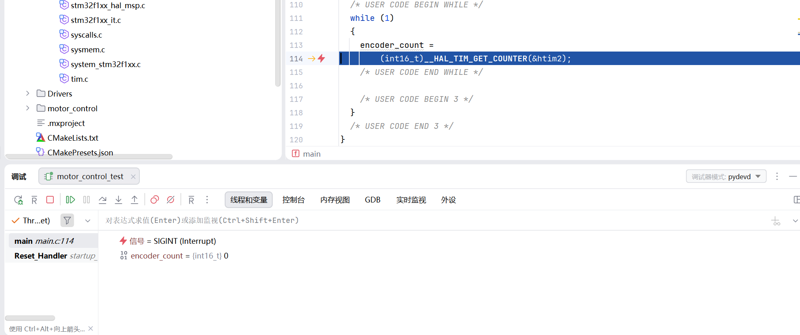
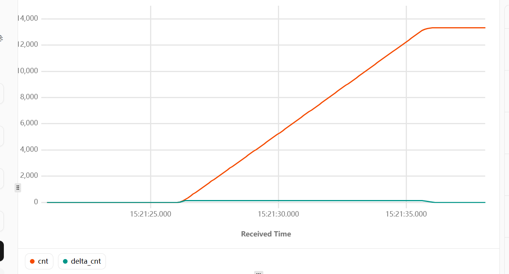
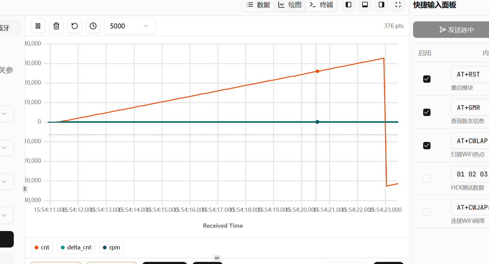
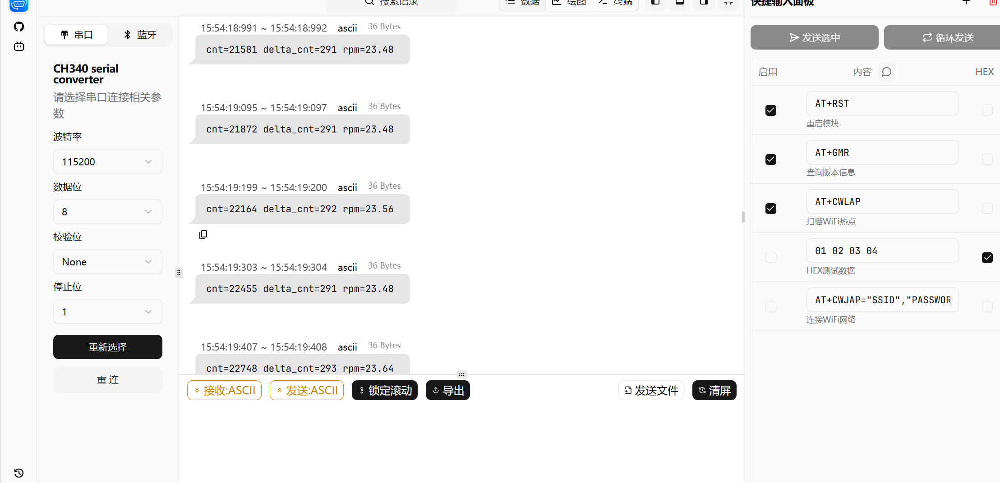
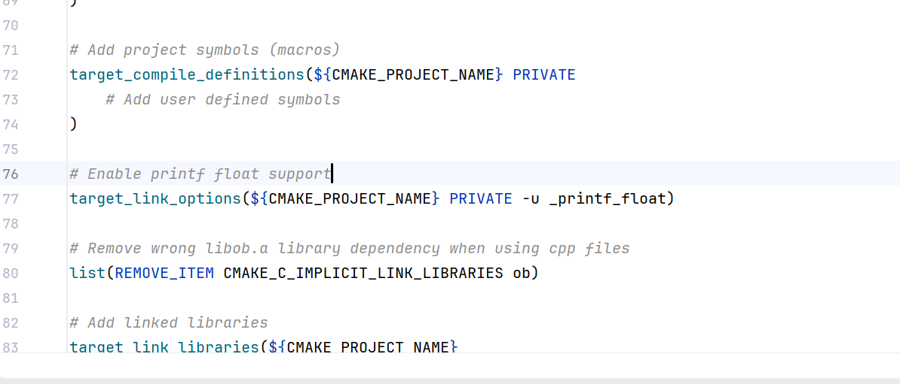
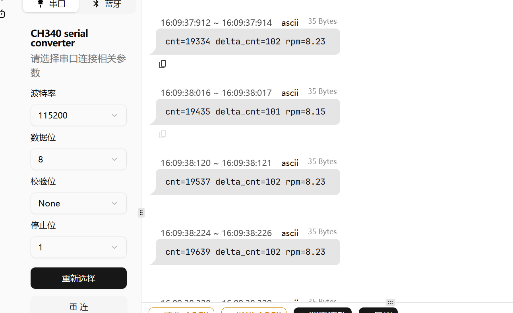
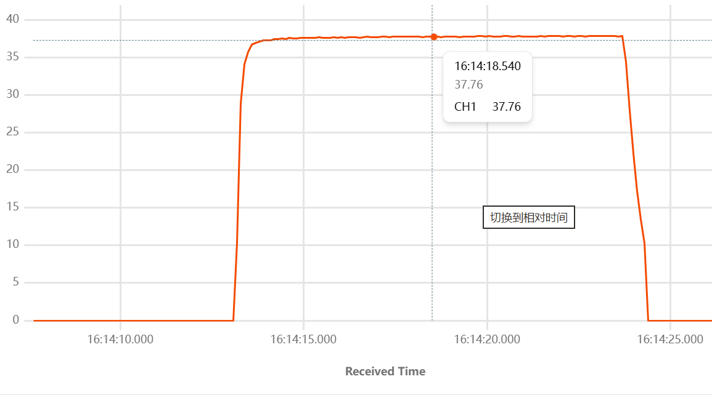
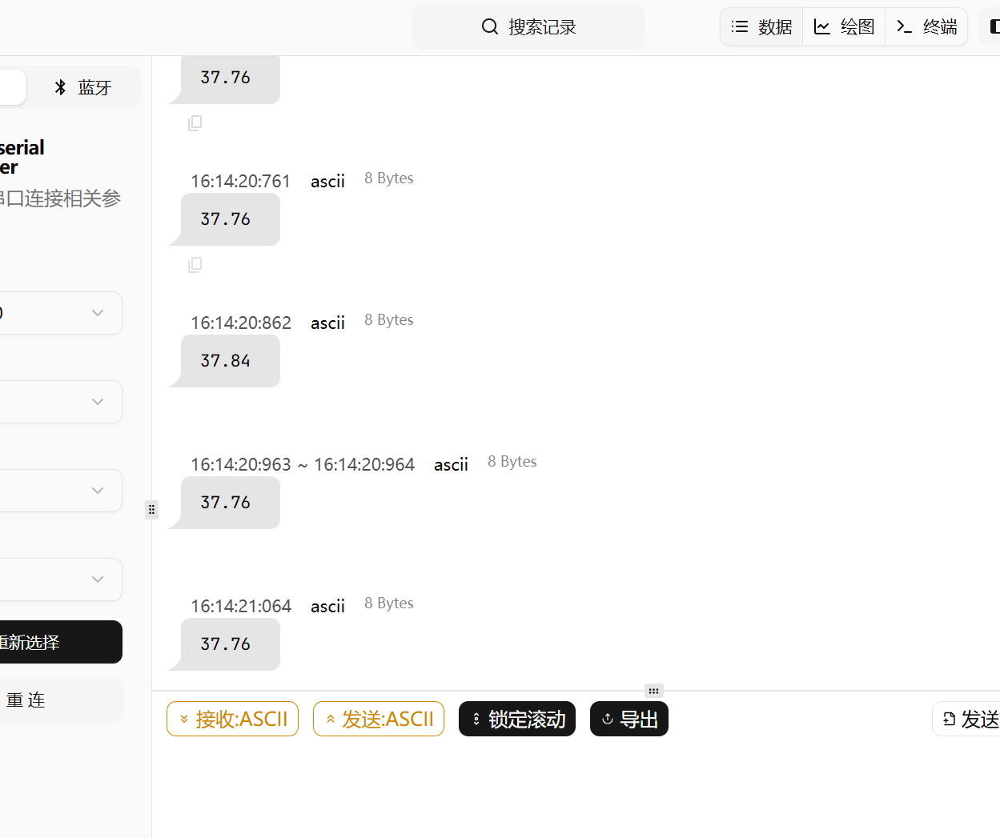

# 10\_初步实现 PWM驱动电机与编码器测速

# 电路连接

```C
PA6 -> PWMA (TIM3_CH1)

PB0 -> AIN1
PB1 -> AIN2
PB10 -> STBY

A相——PA0
B相——PA1

输入电压9.76V
```



# 驱动电机

## 单纯PWM驱动电机实验

```C

  HAL_TIM_PWM_Start(&htim3, TIM_CHANNEL_1);      // PWM

  HAL_TIM_Encoder_Start(&htim2, TIM_CHANNEL_ALL); // 编码器

  HAL_GPIO_WritePin(GPIOB, GPIO_PIN_0, GPIO_PIN_SET);     //AIN1=1
  HAL_GPIO_WritePin(GPIOB, GPIO_PIN_1, GPIO_PIN_RESET);   //AIN2=0

  HAL_GPIO_WritePin(GPIOB, GPIO_PIN_10, GPIO_PIN_SET);    //STBY=1

  __HAL_TIM_SET_COMPARE(&htim3, TIM_CHANNEL_1, 500);
```

### 问题一

电机不转，测量电机正负极：无电压

测各输出模式引脚电压：发现PWM输出为0\.2V，异常

调试发现PWM正确启动了

回到配置界面

查看引脚是否配置正确：选择通道一时是自动选择引脚的，PB4也是TIM3的通道一，自动选择到了PB4，但是我的电路连接是PA6

修改之后重新测PWMA引脚电压：1\.61V  正确

上电，电机转动！

测电机正负极电压是4\.74V

### 问题二



定义了int变量，然后读取编码器值，编码器始终为0

测电压，编码器两端电压没有，测另一端的3\.3V引脚，发现电压只有1\.V甚至0\.77V

可能是负载拉低了单片机引脚电压，不能用引脚作为供电

之间使用稳压电源的5V输出供电，测得的编码器的值是\-5，且长时间不变

将变量改为uint，又是0不变

靠，在这研究了半天，又是引脚被负载拉跨，又是检测供电电压的

之前单独测电机的时候只接了电机的正负极，根本没接编码器AB相

接上之后，计数器数值递减

# 编码器测速

### CH340接通然后调试

回宿舍找到之前用的，没有串口调试太不方便了，接上了没什么问题

## 正式编码器测速

50%固定占空比的变化




### 计算转速后串口调试（固定PWM为50%）

CPR=PPR\*减速比=44\*169=7436

输出rpm没有值，猜测是浮点数的原因

强制转换果然有值了，即sprintf不支持浮点数

先暂时拆分整数一下

```SQL

    integer=(int)rpm;
    decimal=(int)((rpm-integer)*100);

    sprintf(buf, "cnt=%d delta_cnt=%d rpm=%d.%02d \r\n", cnt, delta_cnt,integer,decimal);
```





结果如图。

### CMake修改支持浮点数



这样串口助手的绘图依旧好用

### PWM为20%测速实验



### PWM为80%






