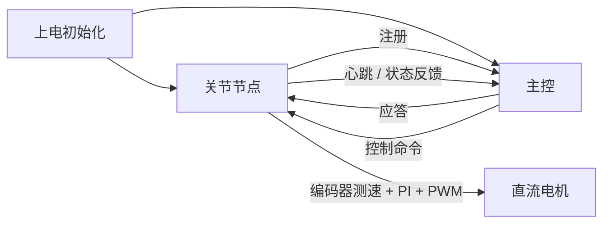

# 项目总览

这是一个基于 STM32F103 与 CAN 总线的分布式机器人关节控制项目。
它的重点不只是“能跑”，而是把节点协同、通信协议、速度闭环和调试过程串成一条完整链路。

## 系统结构

## 节点职责

### Master 主控

- 管理节点注册
- 接收心跳和状态反馈
- 下发控制命令
- 汇总节点在线状态

### JointNode 关节节点

- 接收主控控制命令
- 采集编码器速度
- 执行 PI 速度控制
- 输出 PWM 驱动电机
- 周期性上报状态和心跳

## 运行主线

1. 节点上电并完成初始化
2. 节点向主控发注册报文
3. 主控回送应答，节点进入在线状态
4. 节点开始发送心跳和状态反馈
5. 主控根据目标速度下发控制命令
6. 关节节点根据反馈做闭环调速

## 仓库内容怎么对应

- `01_初始方案草稿`：项目定义、系统设计、状态机设计和接口设计
- `02_开发日志`：按阶段记录的开发过程
- `00_精选调试记录`：最有代表性的排障和修正记录
- `03_过程（实验）程序代码`：实验过程中的程序版本
- `04_最终程序源码`：完整最终源码
- `05_最终程序源码_轻量优化版`：更适合阅读和展示的精简版

## 简历里的一句话

基于 STM32F103 和 CAN 总线实现分布式关节控制网络，完成主控/关节节点协同、节点注册与心跳管理、状态反馈、PI 调速和 PWM 驱动，并沉淀出完整的调试与优化过程。
